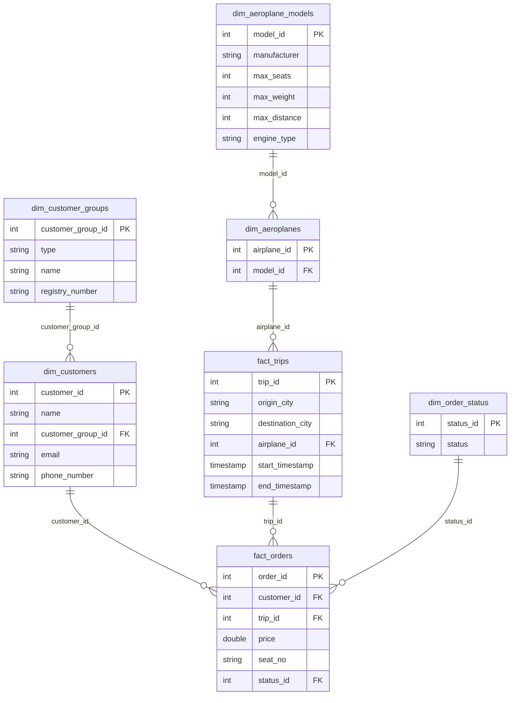

## Air Boltic Data Modeling and Analysis

# Project Overview
This project involves designing a data model for Air Boltic, a hypothetical marketplace for sharing aeroplane rides. The primary goal is to enable monitoring and self-service analysis of the service, which includes understanding customer behavior, tracking trip data, aeroplane utilization, and revenue generation.

The data model is designed using normalization techniques to ensure scalability, maintainability, and data integrity as the service grows.

### ER Diagram

## Data Model Design
The data model is structured to support scalable analytics by organizing the data into fact and dimension tables. It uses a normalized design to ensure minimal redundancy and high data integrity.

### Fact and Dimension Tables
#### Fact Tables:

fact_orders: Contains transactional data related to orders placed by customers for specific trips.
fact_trips: Contains detailed trip information including origin, destination, and aircraft used.

#### Dimension Tables:

`dim_customers`: Describes customers and their associated customer groups. 

`dim_aeroplanes`: Describes the specific aeroplanes used for trips, linked to the aeroplane models.

`dim_aeroplane_models`: Describes general aeroplane models and their specifications (manufacturer, max seats, etc.).

`dim_order_status`: Describes the status of the orders (booked, finished, cancelled).

## Base, Intermediate, and Mart Layers
The models are structured across three layers in the dbt framework:

`Base (Staging) Layer`: Raw data from the source is cleaned and standardized.

#### models: stg_customers, stg_orders, stg_trips, stg_aeroplanes, stg_aeroplane_models.

`Intermediate (Transform) Layer`: Joins and transformations across the base tables to create meaningful relationships and calculations.

#### models: int_customers_with_groups, int_trips_with_planes, int_orders_with_status.

`Mart (Fact and Dimension) Layer`: Business-ready tables used for reporting and analysis.

#### Fact Tables: fact_orders, fact_trips.
#### Dimension Tables: dim_customers, dim_aeroplanes, dim_aeroplane_models, dim_order_status.