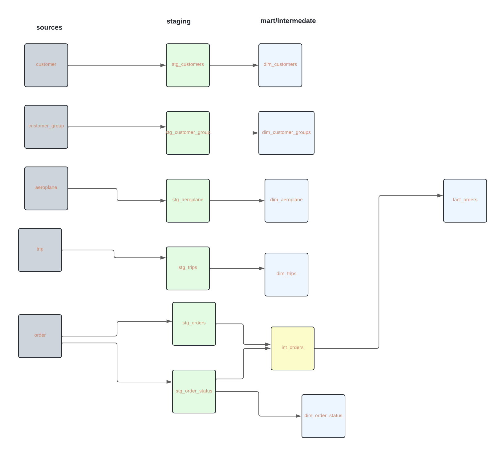

## LINEAGE 

## Base, Intermediate, and Mart Layers
The models are structured across three layers in the dbt framework:

`Base (Staging) Layer`: Raw data from the source is cleaned and standardized.

#### models: stg_customers, stg_orders, stg_trips, stg_aeroplanes, stg_aeroplane_models.

`Intermediate (Transform) Layer`: Joins and transformations across the base tables to create meaningful relationships and calculations.

#### models:  int_orders.

`Mart (Fact and Dimension) Layer`: Business-ready tables used for reporting and analysis.

#### Fact Tables: fact_orders.
#### Dimension Tables: dim_customers, dim_aeroplanes, dim_aeroplane_models, dim_order_status.